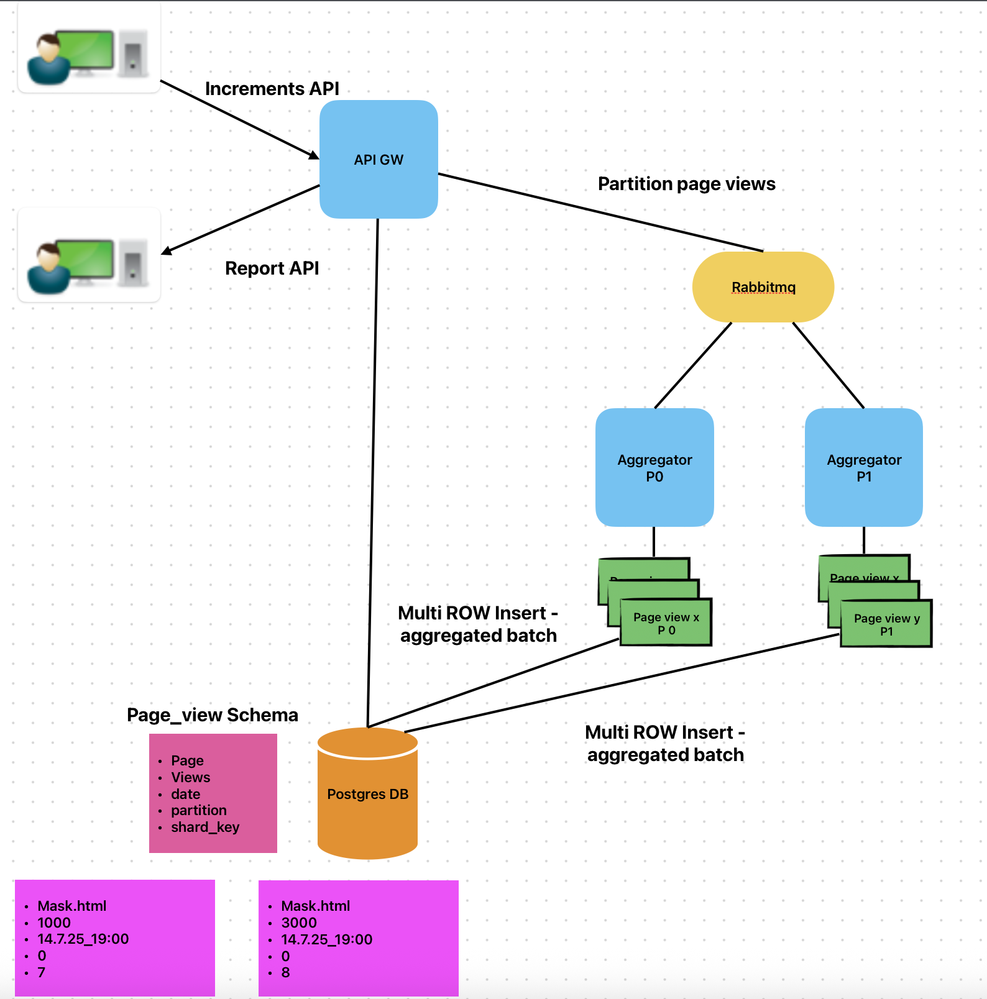
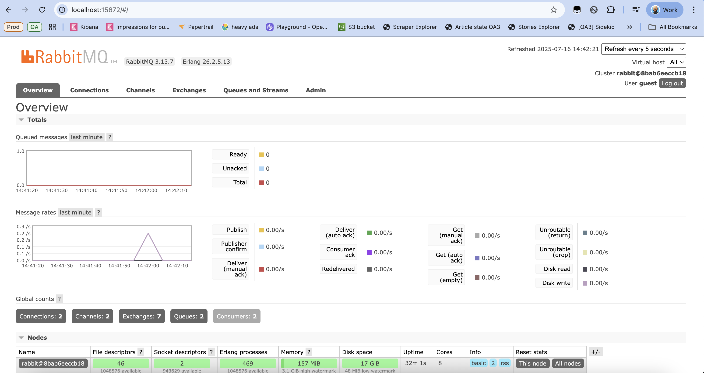
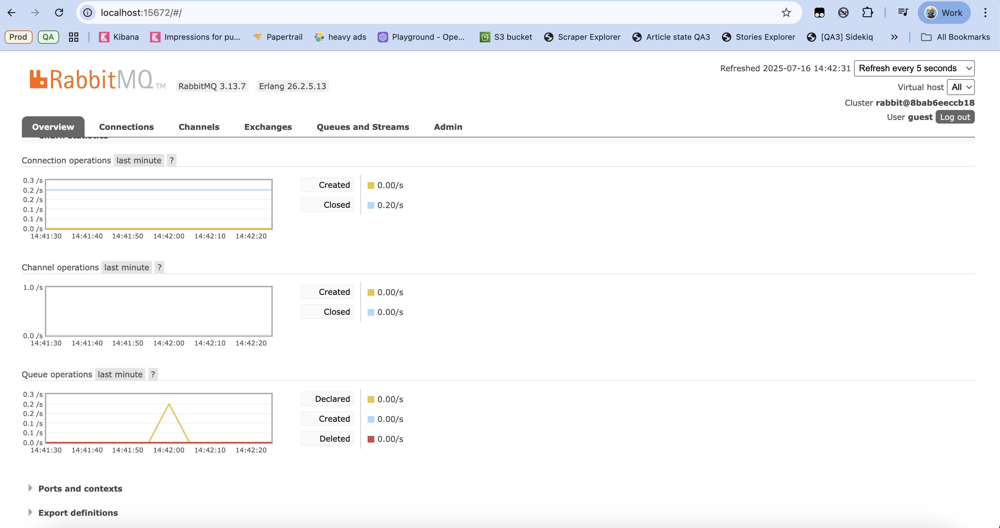

# Page Views Analytics Service

A scalable analytics service that tracks and aggregates page views using Node.js, RabbitMQ, and PostgreSQL.

## Architecture

The service consists of:

- A REST API server for receiving and querying page views

- Worker processes for aggregating data

- RabbitMQ for message queuing

- PostgreSQL for data storage

The system uses a partitioned architecture where page views are distributed across workers based on the page URL, enabling parallel processing and improved scalability.

The workers are responsible for aggregating page view requests, ensuring that write-heavy operations are handled efficiently.
To further reduce write conflicts and increase throughput, the service implements row-level sharding using a random shard key. It's minimizing contention and optimizing performance under high load.




## Features

- Track single page views with timestamp
- Batch upload multiple page views
- Get hourly page view reports
- Configurable time ranges and sorting for reports
- Scalable through partitioned processing & row sharding.

## Known Issues
- Missing cleanup process for stale data: The system currently lacks a background cleaner to remove older rows, which may lead to unbounded growth in storage over time

## Prerequisites

- Docker
- Docker Compose

## Configuration

The service can be configured through environment variables in the docker-compose.yml file:

```yaml
POSTGRES_USER=postgres
POSTGRES_PASSWORD=postgres
POSTGRES_DB=analytics
POSTGRES_HOST=postgres
RABBITMQ_URL=amqp://rabbitmq:5672
NUM_PARTITIONS=10
FLUSH_INTERVAL_MS=5000
BATCH_SIZE=100
NUM_SHARDS=10
```

## Running the Service

1. Clone the repository:
```bash
git clone <repository-url>
cd analytics
```

2. Start all services using Docker Compose:
```bash
docker-compose up -d
```

This will:
- First build the Docker images for the API and worker services (only needed first time or when Dockerfile changes)
- Start all services:
  - API server on port 3000
  - PostgreSQL on port 5432
  - RabbitMQ on ports 5672 (AMQP) and 15672 (Management UI)
  - Worker processes for data aggregation

Note: If you make changes to the code and want to rebuild the images, you can use:
```bash
docker-compose up -d --build
```

3. To check the status of all services:
```bash
docker-compose ps
```

4. View logs:
```bash
# All services
docker-compose logs -f

# Specific service
docker-compose logs -f api
docker-compose logs -f worker
```

## API Endpoints

### Health Check
```
GET /health
Response: { "status": "ok" }
```

### Record Single Page View
```
POST /page-views/single
Body: {
    "page": "example.com/page",
    "timestamp": "2025-07-16T10:00:00Z"
}
```

### Record Multiple Page Views
```
POST /page-views/multi
Body: {
    "example.com/page1": {
        "2025-07-16T10:00:00Z": 5,
        "2025-07-16T11:00:00Z": 3
    },
    "example.com/page2": {
        "2025-07-16T10:00:00Z": 2
    }
}
```

### Get Page View Report
```
GET /report?page=page1
Query Parameters:
- now: ISO timestamp (optional)
- order: 'asc' or 'desc' (optional, default: 'asc')
- take: number of records (optional)

Response: {
    "data": [
        { "h": 10, "v": 5 },
        { "h": 11, "v": 3 }
    ]
}
```

## Development

To run the services in development mode:

1. Install dependencies:
```bash
npm install
```

2. Start the API server:
```bash
npm run dev
```

3. Start the worker:
```bash
npm run worker
```

## Stopping the Service

To stop all services:
```bash
docker-compose down
```

To stop and remove all data (including volumes):
```bash
docker-compose down -v
```

## Database Access

You can directly connect to the PostgreSQL database running in Docker to inspect the data:

```bash
docker compose exec postgres psql -U postgres -d analytics
```

### Example Database Queries

Once connected, here are some useful PostgreSQL commands:

1. List all tables:
```sql
\dt

           List of relations
 Schema |    Name    | Type  |  Owner
--------+------------+-------+----------
 public | page_views | table | postgres
```

2. Show table structure:
```sql
\d page_views

                        Table "public.page_views"
  Column   |            Type             | Collation | Nullable | Default
-----------+-----------------------------+-----------+----------+---------
 page      | character varying(255)      |           | not null |
 view_hour | timestamp without time zone |           | not null |
 views     | integer                     |           | not null | 0
 partition | integer                     |           | not null |
Indexes:
    "page_views_pkey" PRIMARY KEY, btree (page, view_hour)
```

3. Query page views data:
```sql
SELECT * FROM page_views;

    page     |      view_hour      | views | partition
-------------+---------------------+-------+-----------
 /home       | 2025-07-16 11:00:00 |     7 |         1
 /home       | 2025-07-16 12:00:00 |     3 |         1
 altman.html | 2025-07-16 14:00:00 |   108 |         1
 altman.html | 2025-07-16 16:00:00 |    68 |         1
 /about      | 2025-07-16 11:00:00 |    46 |         1
 altman.html | 2025-07-16 11:00:00 |     2 |         1
```

### Useful PostgreSQL Commands

- `\dt` - List all tables
- `\d table_name` - Describe table structure
- `\q` - Quit psql
- `\?` - Show all available commands
- `\h` - Show SQL command help

## RabbitMQ Management Dashboard

You can access the RabbitMQ Management UI through your web browser:

```
http://localhost:15672
```

Default credentials:
- Username: guest
- Password: guest

The management interface allows you to:
- Monitor queue sizes and message rates
- View connected consumers
- Check exchange bindings
- Monitor resource usage
- Access detailed metrics and statistics

Here are some examples of what you'll see in the RabbitMQ Management Dashboard:



